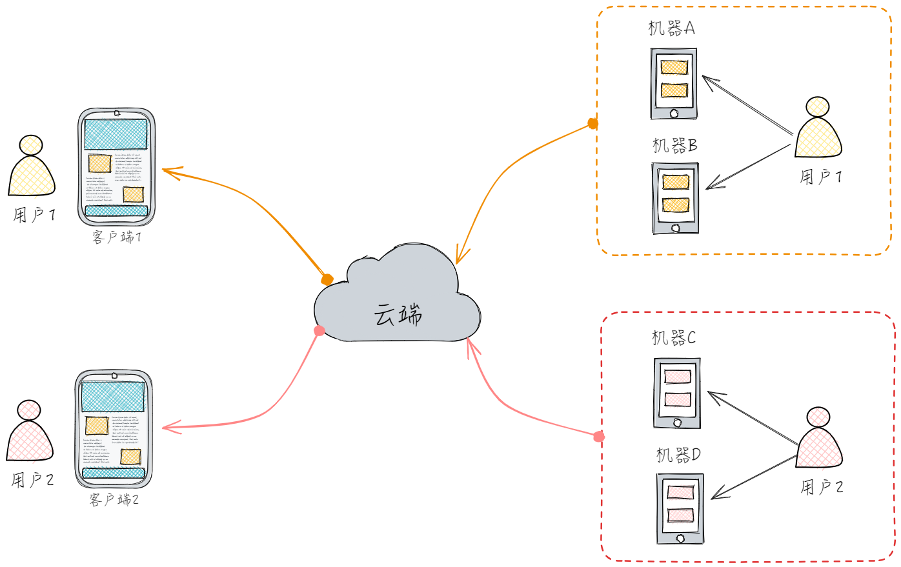
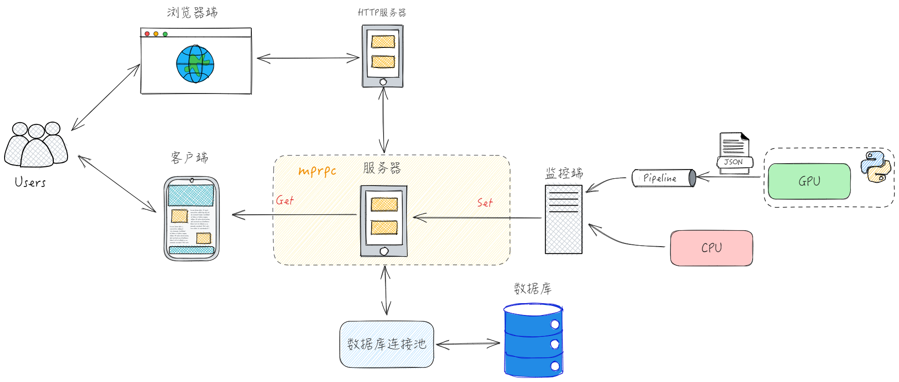
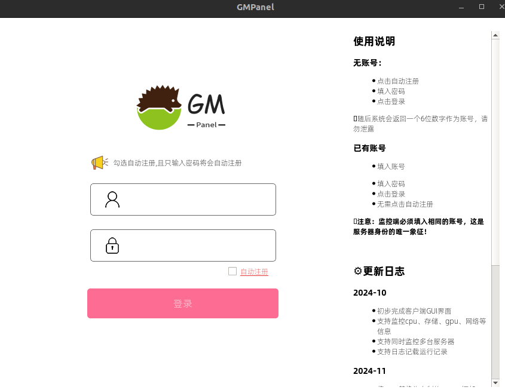
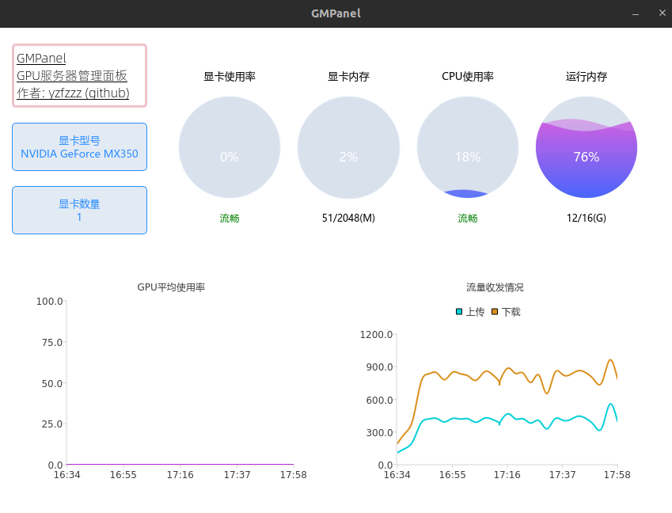
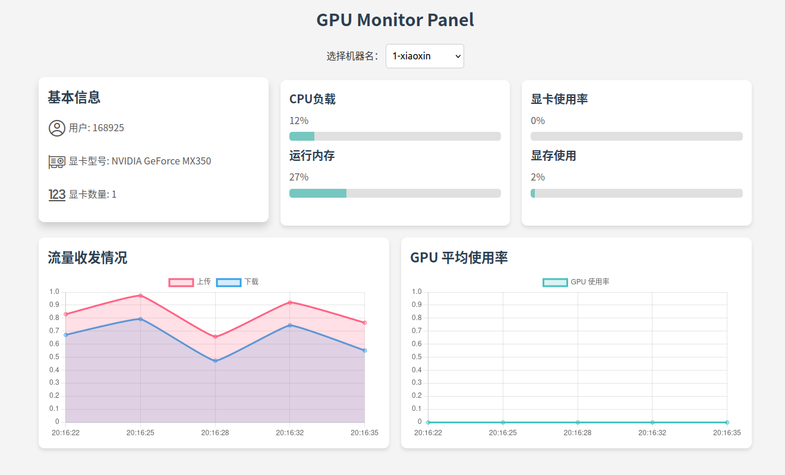
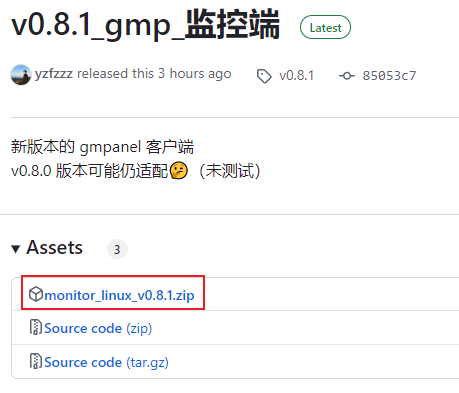

# GMPanel：GPU服务器管理面板

## 🎉项目意义

对于搞深度学习的学生，如果你是使用公共 GPU 服务器集群的话，也许这个项目对你有帮助

它可以让你在手机上就查看服务器的显存大小, 无需 ssh 登录服务器, 然后输入 nvidia-smi 命令


## ⚙功能

- [x] 客户端GUI界面
- [x] 支持监控cpu、存储、gpu、网络等信息
- [x] 支持同时监控多台服务器
- [x] 支持日志记载运行记录
- [x] mysql数据库保存历史数据
- [x] 客户端界面美化
- [x] 用户登陆/注册功能
- [x] 同一用户多台主机同时监测
- [x] 支持网页端实时监控
- [x] 网页端实时监控登录注册功能
- [x] 服务端压力测试，监控端显卡压力测试
- [x] 客户端打包exe文件(win)/bin文件(linux)，发布reslease版本
- [ ] 代码优化，系统优化


## ✨特色



1. 采用SOA架构，监控端、服务端、客户端代码分离
2. 采用自研的 [mprpc](https://github.com/yzfzzz/mprpc) 微服务架构，不依赖第三方rpc框架（如grpc、brpc等）
3. docker一键部署，免去复杂的环境配置
4. 支持同时监控多用户、多GPU服务器集群
5. 安全，不暴露本地端口
6. 支持历史数据云备份
7. 支持客户端、网页端多端实时监控


## 🗂文件

| 文件名                                                       | 说明              |
| ------------------------------------------------------------ | ----------------- |
| [bin](https://github.com/yzfzzz/linux-monitor/tree/main/bin) | 可执行文件        |
| [database](https://github.com/yzfzzz/linux-monitor/tree/main/database) | mysql数据库连接池  |
| [display_monitor](https://github.com/yzfzzz/linux-monitor/tree/main/display_monitor) | 客户端（当前版本已不兼容）               |
| [docker](https://github.com/yzfzzz/linux-monitor/tree/main/docker) | 环境配置          |
| [mprpc](https://github.com/yzfzzz/linux-monitor/tree/main/mprpc) | 自制的rpc框架     |
| [proto](https://github.com/yzfzzz/linux-monitor/tree/main/proto) | 数据传输格式      |
| [rpc_manager](https://github.com/yzfzzz/linux-monitor/tree/main/rpc_manager) | rpc客户端、服务端 |
| [test](https://github.com/yzfzzz/linux-monitor/tree/main/test) | 功能开发测试      |
| [test_monitor](https://github.com/yzfzzz/linux-monitor/tree/main/test_monitor) | 监控端（当前版本已不兼容）            |
| [utils](https://github.com/yzfzzz/linux-monitor/tree/main/utils) | 第三方/自己实现的功能库  |

## 😍效果
登录注册界面<br>
<br>
qt客户端界面<br>
<br>
网页端登录界面<br>
<br>
网页端主界面<br>
<br>

## 怎么用？
### 快速使用
1. 点击[下载文件](https://github.com/yzfzzz/GMPanel/releases/tag/v0.8.1)，解压到服务器任意目录<br>
<br>
2. 修改配置文件config.yaml，修改账号，机器名自定义
    ```yaml
    # 用户账号，新用户先需要注册
    accountnum: "168925"
    # 机器名，同一用户的多台机器名必须不同
    machine_name: 1-xiaoxin
    # 监控每获取数据的间隔, 可以不改
    sleep_time: 5
    ```
3. 直接运行
    ```shell
    ./gmpanel_client
    ```
### 自己搭建服务
建议使用我提供的云服务器

如果你需要搭建自己的服务器(当前版本下不建议, 因为IP/端口/数据库需要修改代码手动配置)，可以参考如下步骤:

docker环境的安装：https://www.yuque.com/yangshengdashi/isfgw0/hpaccn8i10g0fcre?singleDoc#

先配置好docker环境，生成镜像，镜像名应为 linux:mprpc_monitor

然后：

```shell
./docker/scripts/monitor_docker_run.sh
./docker/scripts/monitor_docker_into.sh
cd ./home/work
./docker/build/install/start.sh
```

一键配置环境👆

然后，运行服务端和监控端

```shell
cd bin
./server
./http_server
```
## Join Us
由于这个项目仍不够完善，如果你有更好的想法，欢迎提issue，一起交流。

b站: https://space.bilibili.com/517357927
